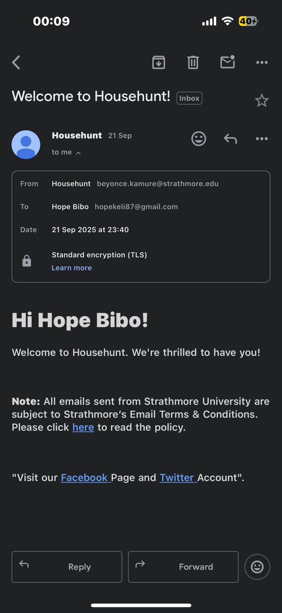
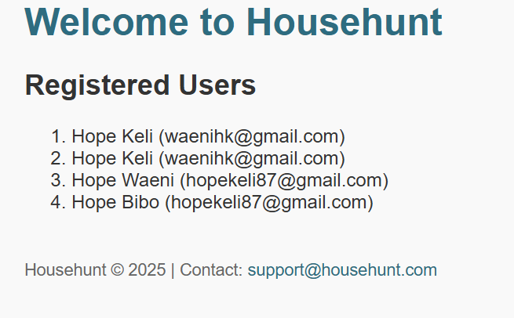
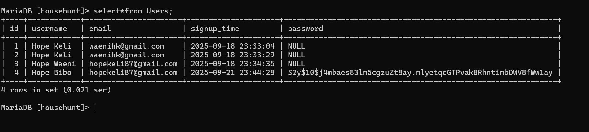
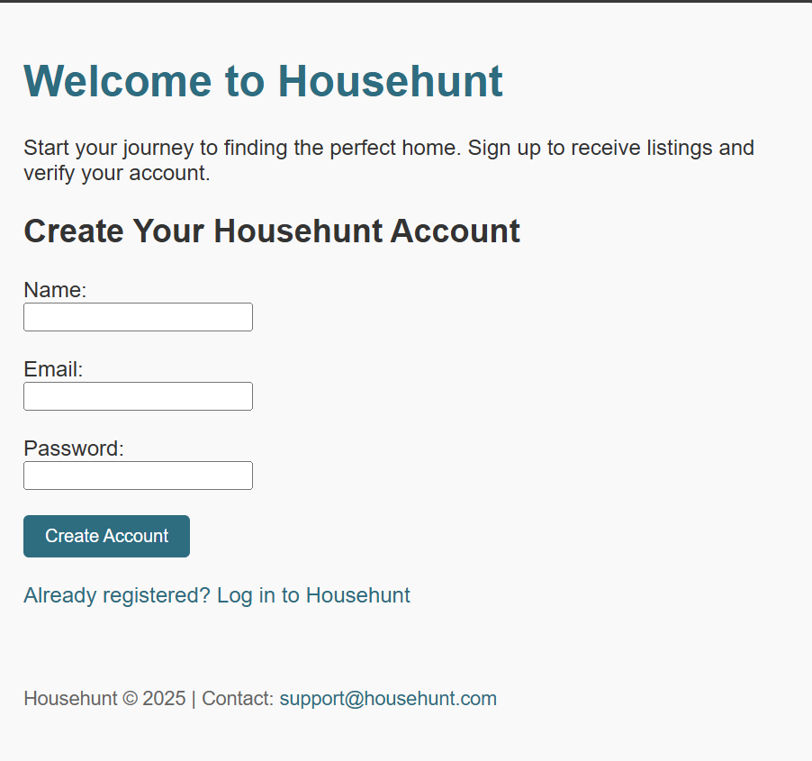

Househunt is a PHP-based web application that allows users to sign up securely, receive a personalized welcome email, and view a numbered list of all registered users. Built with modular architecture and Composer-managed dependencies, the project features email validation, password hashing, and dynamic user listing from a MariaDB database. The codebase includes autoloading for clean class management, and all Git workflow steps are documented for transparency. Welcome to Househunt.
 Features
• 	User signup with email and password
• 	Email validation and password hashing
• 	Welcome email sent via PHPMailer
• 	Numbered list of users displayed in ascending order
• 	Modular structure with autoloading
• 	Git workflow documented in 

Project Structure

HOUSEHUNT/
├── includes/
│   ├── ClassAutoLoader.php
│   ├── database.php
│   ├── Forms.php
│   ├── Layouts.php
│   ├── User.php
├── vendor/               # Composer dependencies
├── composer.json
├── composer.lock
├── config.php
├── git_workflow.txt
├── index.php
├── mail.php
├── signup.php
├── users.php

Images

Git Workflow
All Git steps used to version and submit this project are documented in git_workflow.txt.
